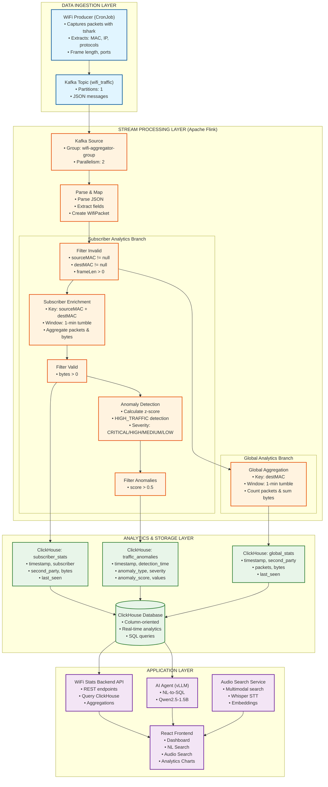

# WiFi Traffic Analytics - Flink Pipeline Architecture

## Overview
Real-time WiFi traffic analytics pipeline using Apache Flink for stream processing, Kafka for data ingestion, and ClickHouse for analytics storage.

## Pipeline Diagram

## Data Flow Details

### 1. Ingestion Phase
- **WiFi Producer**: CronJob running on wifi-sniffer node
  - Uses `tshark` to capture network packets
  - Produces ~10 packets/second to Kafka
  - JSON format with metadata extraction

### 2. Stream Processing Phase (Flink)
- **Parallelism**: 2 task slots
- **Windowing**: 1-minute tumbling windows
- **Checkpointing**: Every 60 seconds
- **State Backend**: Filesystem (local storage)

### 3. Processing Branches

#### Branch A: Subscriber Analytics
- Groups by (sourceMAC, destMAC) pairs
- Aggregates traffic per subscriber
- Tracks unique destinations
- Outputs to `subscriber_stats` table

#### Branch B: Anomaly Detection
- Calculates statistical baselines
- Computes z-scores for traffic patterns
- Detects outliers and unusual behavior
- Assigns severity levels
- Outputs to `traffic_anomalies` table

#### Branch C: Global Analytics
- Groups by destination MAC only
- Aggregates total traffic per destination
- Tracks packet counts and bytes
- Outputs to `global_stats` table

### 4. Storage Phase (ClickHouse)
- **Database**: Default database
- **Tables**: 3 aggregated tables
- **User**: `flink` (with read/write permissions)
- **Query Latency**: Sub-second for most queries

### 5. Application Phase
- **Backend API**: Node.js/Express serving REST endpoints
- **AI Agent**: vLLM serving Qwen2.5-1.5B for natural language queries
- **Audio Search**: Whisper + SentenceTransformers for multimodal search
- **Frontend**: React SPA with real-time dashboards

## Key Metrics

- **Throughput**: ~10-20 packets/second
- **Latency**: 1-minute window latency
- **Storage**: Time-series data with 24-hour retention queries
- **Anomaly Detection**: Real-time with configurable thresholds

## Technologies

- **Stream Processing**: Apache Flink 1.18
- **Message Queue**: Apache Kafka (Strimzi)
- **Database**: ClickHouse 25.11
- **Container Runtime**: K3s with containerd
- **Language**: Java (Flink), JavaScript (Backend), Python (AI/Audio)
